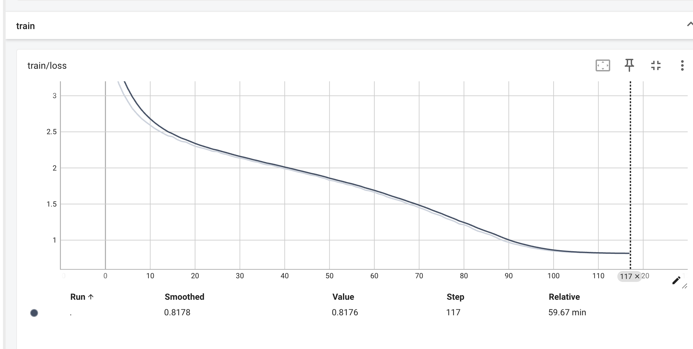
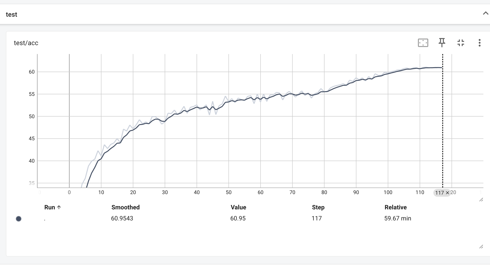
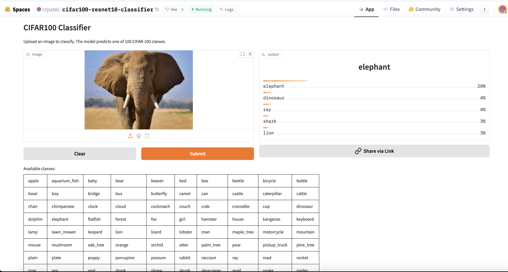

# CIFAR-100-Experiment
CIFAR -100 Training
Task :
1) Train CIFAR 100 from scratch using Resnet-18 no pretrained weights
2) Train on AWS EC2 instances
3) Modular coding and using pytorch best hacks
4) Deploy app on Huggingface Space

## Train Logs


## Test Accuracy


## Deploy on GRADIO


```app.py
# app.py
import gradio as gr
import torch
import torchvision.transforms as transforms
from PIL import Image
import os
from pathlib import Path
import numpy as np

class CIFAR100mageClassifier:
    def __init__(self, model_dir=None, # Changed default to None
                     model_file_name="resnet18_cifar100.pt",
                     labels_path='cifar100_labels.txt'):
        self.device = torch.device('cuda' if torch.cuda.is_available() else 'cpu')
        print(f"Using device: {self.device}")

        # Determine the model path dynamically
        if model_dir is None:
            # Assume model is in the same directory as this script if model_dir is not provided
            model_full_path = Path(__file__).parent / model_file_name
        else:
            model_full_path = Path(model_dir) / model_file_name

        if not model_full_path.exists():
            raise FileNotFoundError(f"Model file not found at {model_full_path}. Please ensure it exists.")

        # Load the traced model
        self.model = torch.jit.load(model_full_path, map_location=self.device)
        self.model.eval()

        # Define the same transforms used during training/testing
        self.transforms = transforms.Compose([
            transforms.Resize(32), # CIFAR-100 images are 32x32
            transforms.ToTensor(),
            transforms.Normalize((0.5071,0.4867,0.4408),(0.2675,0.2565,0.2761)),
        ])

        # Load labels from file
        labels_full_path = Path(__file__).parent / labels_path
        if not labels_full_path.exists():
            raise FileNotFoundError(f"Labels file not found at {labels_full_path}. Please ensure it exists.")
        with open(labels_full_path, 'r') as f:
            self.labels = [line.strip() for line in f.readlines()]

    @torch.no_grad()
    def predict(self, image):
        if image is None:
            return None

        # Convert to PIL Image if needed
        # Gradio's Image component returns a numpy array if source is 'upload' or 'webcam',
        # and PIL Image if source is 'clipboard'. We should handle both.
        if isinstance(image, np.ndarray):
            image = Image.fromarray(image).convert('RGB')
        elif not isinstance(image, Image.Image):
            # Attempt to convert to RGB if it's a different PIL image mode
            image = image.convert('RGB')

        # Preprocess image
        img_tensor = self.transforms(image).unsqueeze(0).to(self.device)

        # Get prediction
        output = self.model(img_tensor)
        probabilities = torch.nn.functional.softmax(output[0], dim=0)

        # Create prediction dictionary
        return {
            self.labels[idx]: float(prob)
            for idx, prob in enumerate(probabilities)
        }

# Create classifier instance
# Pass model_dir=None to load from the same directory as this script
classifier = CIFAR100mageClassifier(model_dir=None)

# Format available classes into HTML table - 10 per row
formatted_classes = ['<tr>']
for i, label in enumerate(classifier.labels):
    if i > 0 and i % 10 == 0:
        formatted_classes.append('</tr><tr>')
    formatted_classes.append(f'<td>{label}</td>')
formatted_classes.append('</tr>')

# Create HTML table with styling
table_html = f"""
<style>
    .food-classes-table {{
        width: 100%;
        border-collapse: collapse;
        margin: 10px 0;
    }}
    .food-classes-table td {{
        padding: 6px;
        text-align: center;
        border: 1px solid var(--border-color-primary);
        font-size: 14px;
        color: var(--body-text-color);
    }}
    .food-classes-table tr td {{
        background-color: var(--background-fill-primary);\
    }}
</style>
<table class="food-classes-table">
    {''.join(formatted_classes)}
</table>
"""

# Create Gradio interface
demo = gr.Interface(
    fn=classifier.predict,
    inputs=gr.Image(type="pil"), # Specify type="pil" to get a PIL Image object
    outputs=gr.Label(num_top_classes=5),
    title="CIFAR100 Classifier",
    description="Upload an image to classify. The model predicts one of 100 CIFAR-100 classes.",
    examples=[
        # You'll need to create a 'sample_data' directory and place images there
        # For now, I'll comment these out or you can provide dummy paths if you don't have images yet
        # ["sample_data/apple_pie.jpg"],
        # ["sample_data/pizza.jpg"]
    ],
    article=f"Available classes:<br>{table_html}"
)


if __name__ == "__main__":
    demo.launch(share=True)
```

## To Deploy this as Gradio app on Huggingface Spaces:

**1. Create a new Hugging Face Space:**

    - Go to Hugging Face Spaces.
    - Click on "Create new Space".
    - Choose "Gradio" as the Space SDK.
    - Give your Space a name (e.g., cifar100-resnet18-classifier).
    - Select a license and visibility.
    - Click "Create Space".
**2. Clone the Space's Repository:**

 - After creating the Space, you'll be redirected to its page.
 - Click on the "Files" tab and then "Clone repository" to get the Git URL.
 - Clone it to your local machine: git clone <your-space-git-url>

 **3. Create requirements.txt**
 ```requirements.txt
# requirements.txt
--extra-index-url https://download.pytorch.org/whl/cpu
torch==2.1.0+cpu
torchvision==0.16.0+cpu
gradio
Pillow
numpy<2.0
```

**4. commit and push**
 - Add all the new files to Git: git add .
 - Commit your changes: git commit -m "Add CIFAR-100 Gradio app"
 - Push to Hugging Face: git push

## Directory Structure for Gradio app
```
   gradio_app/
   ├── app.py                      # (renamed from cifar_app.py)
   ├── requirements.txt
   ├── resnet18_cifar100.pt        # Your model file
   ├── cifar100_labels.txt         # (if you have this)
   └── sample_data/                # (optional, for examples)
       ├── image1.jpg
       └── image2.jpg
```


# Gradio Experiment


- Click Here to Test app : [CIFAR10APP](https://huggingface.co/spaces/crpatel/cifar100-resnet18-classifier)